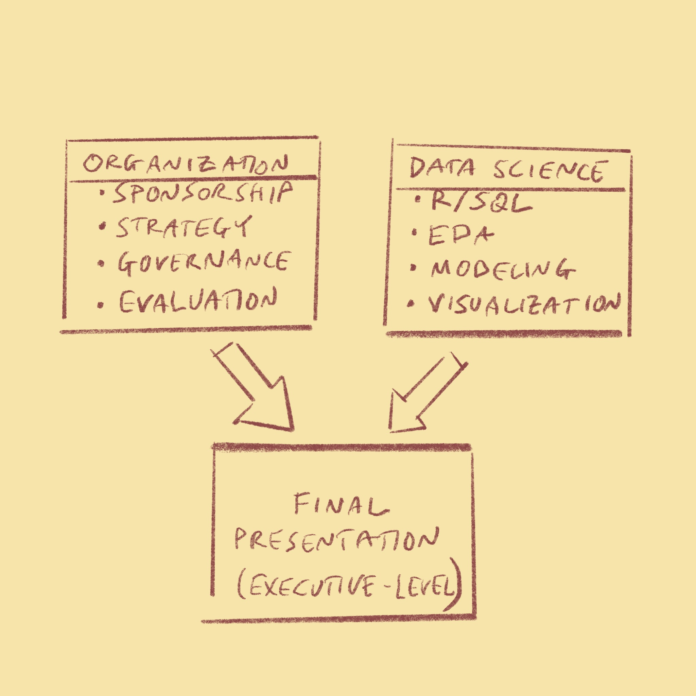
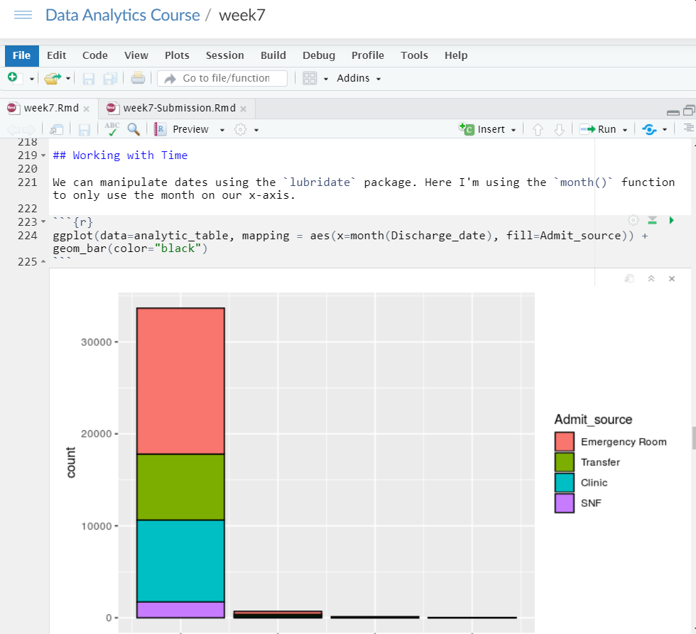
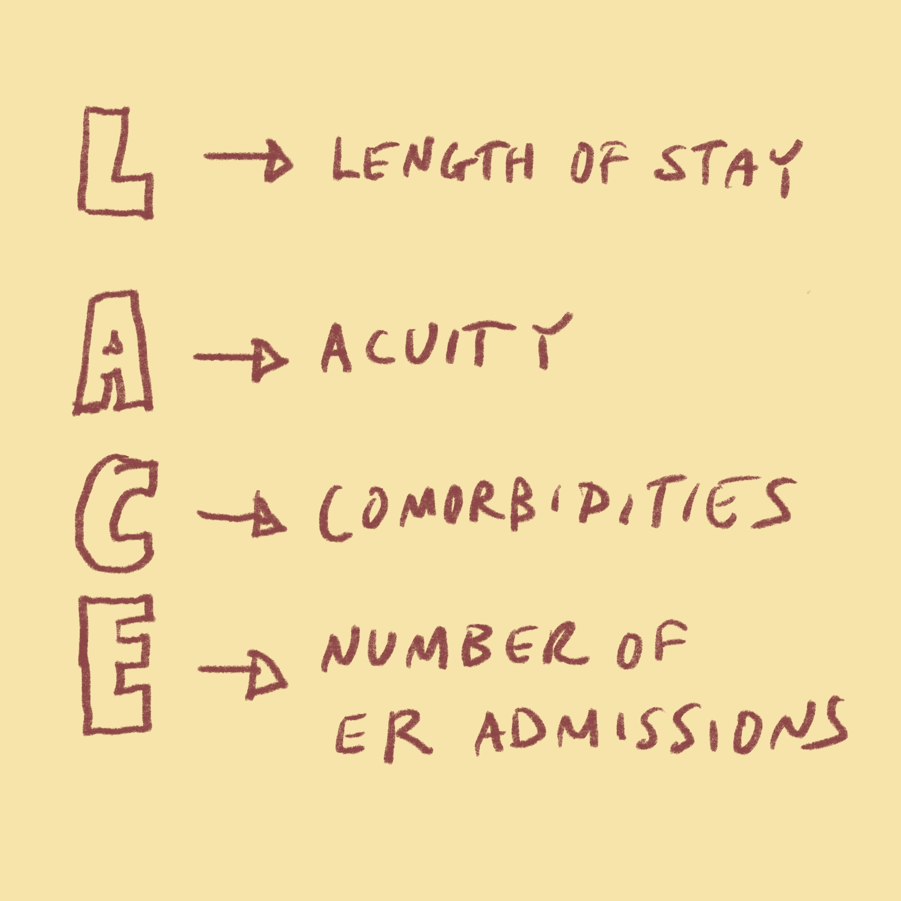
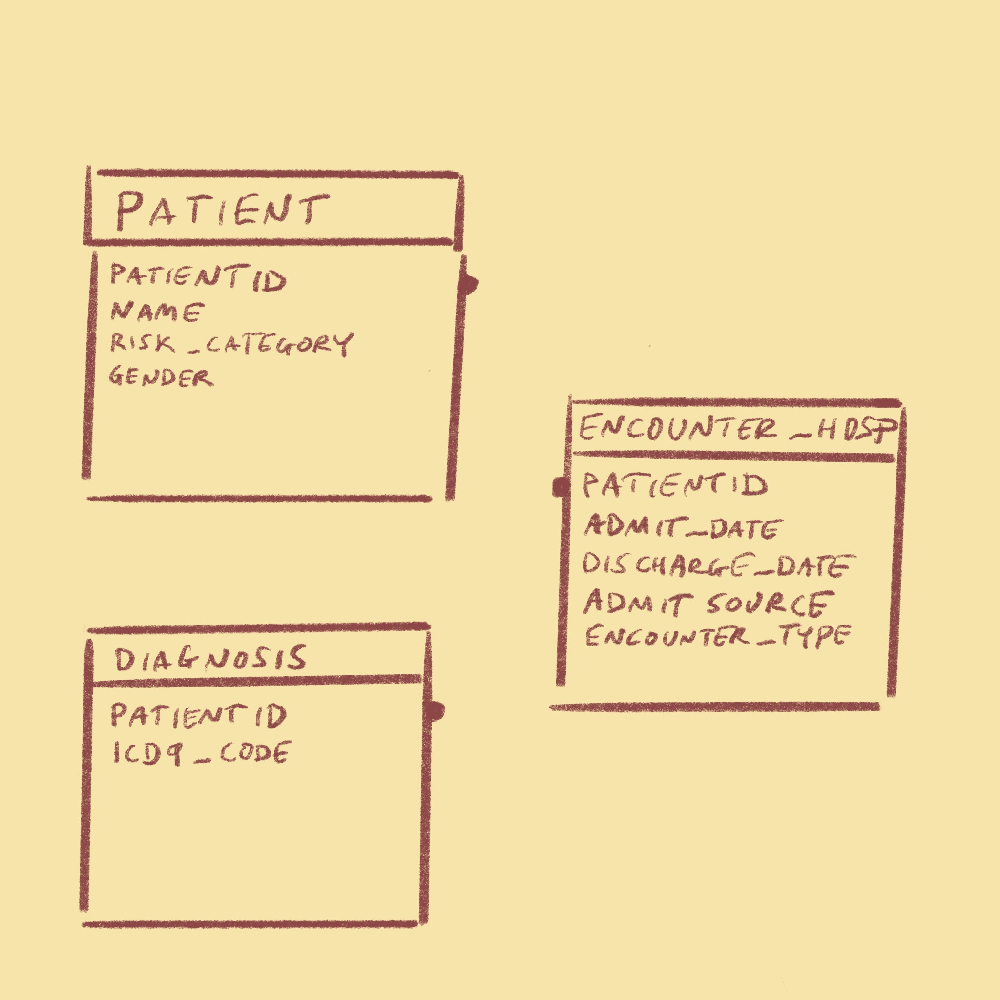
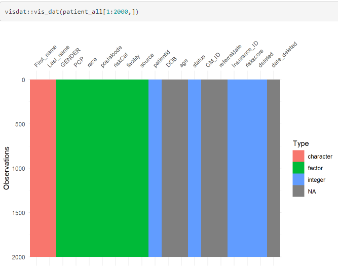
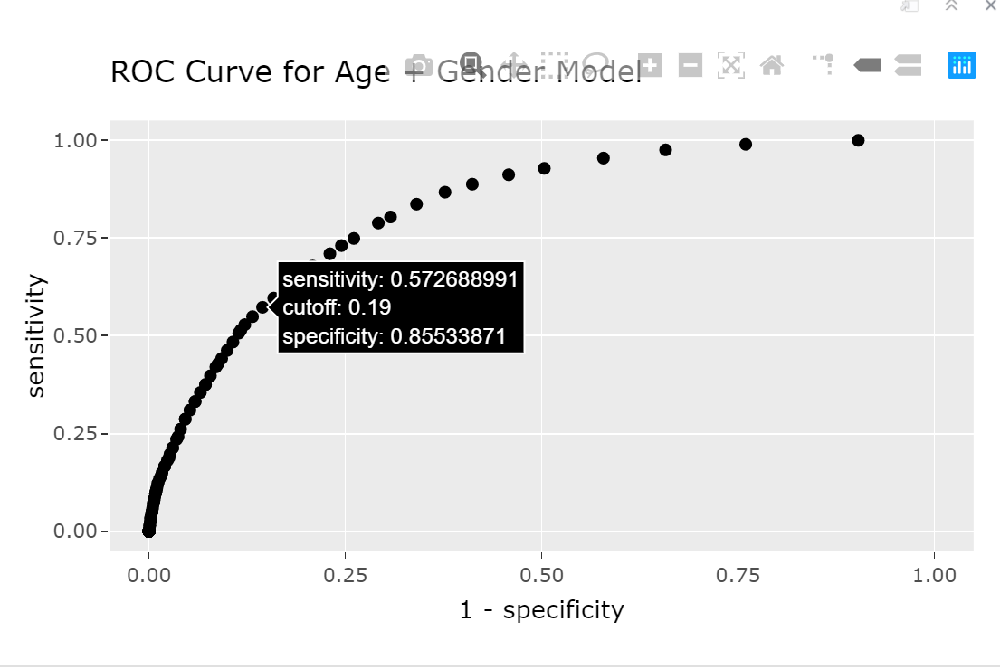
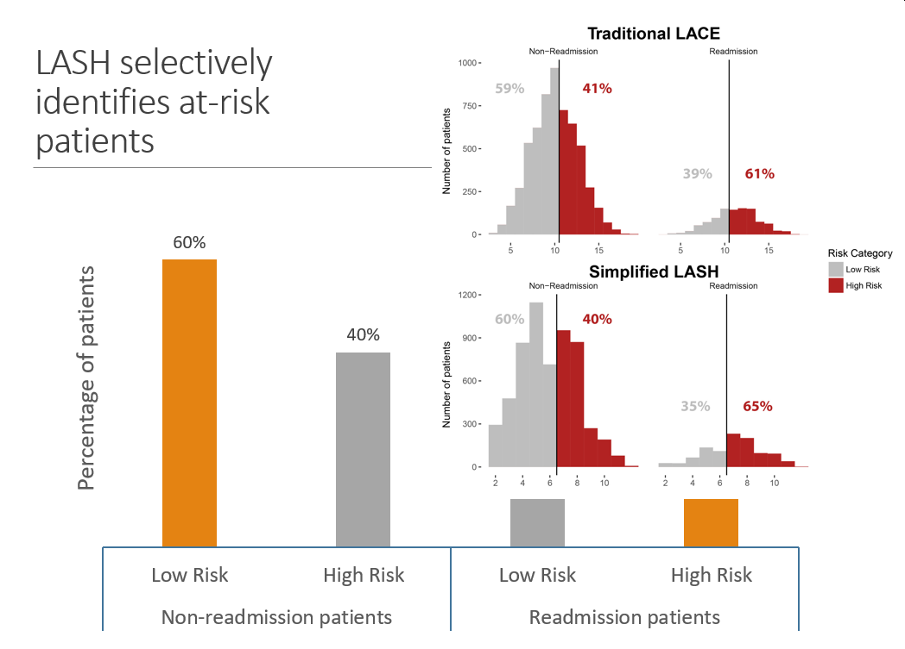
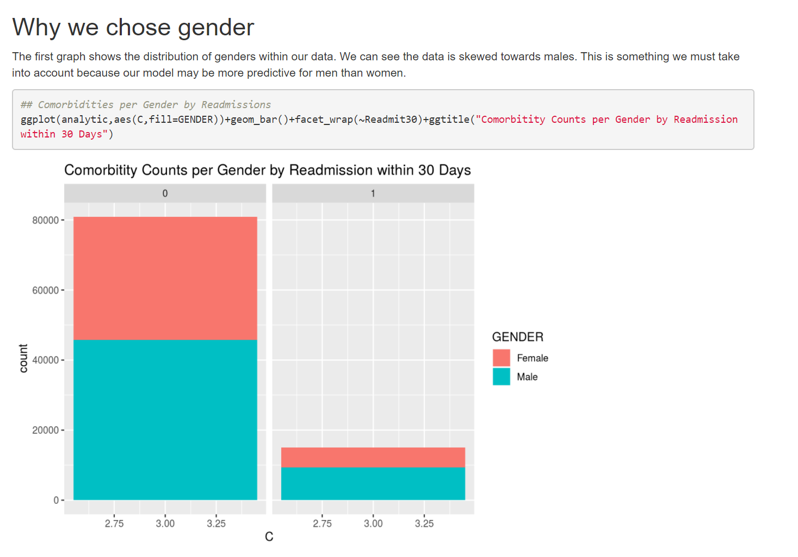
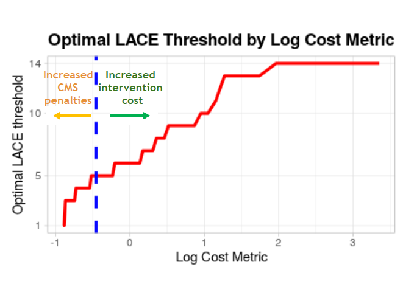
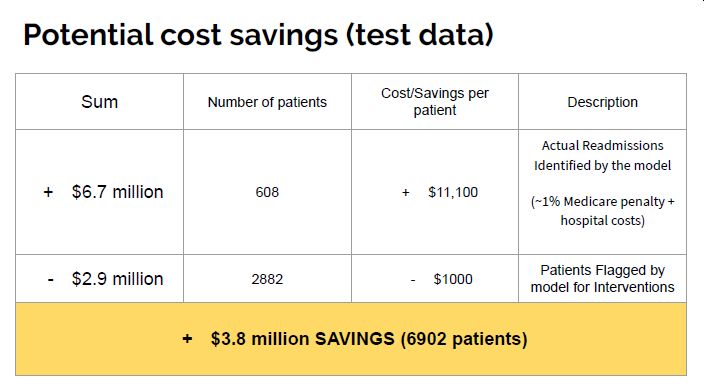

```{r setup, include=FALSE}
options(htmltools.dir.version = FALSE)
```


```{r xaringan-themer, include = FALSE}
library(xaringanthemer)
mono_light(
  base_color = "midnightblue",
  header_font_google = google_font("Josefin Sans"),
  text_font_google   = google_font("Montserrat", "300", "300i"),
  code_font_google   = google_font("Droid Mono"),
  link_color = "deepskyblue1",
  text_font_size = "28px"
)
```

```{r xaringanExtra, echo=FALSE}
xaringanExtra::use_xaringan_extra(c("tile_view", "animate_css", "tachyons"))
```

```{r xaringan-panelset, echo=FALSE}
xaringanExtra::use_panelset()
```

class: center, middle
# The MD in .Rmd
## Teaching Clinicians Data Analytics in R

### Ted Laderas (laderast@ohsu.edu)
#### Oregon Health & Science University

### Brian Sikora
#### Kaiser Permanente Insight

### R/Medicine 2020
#### Slides: http://bit.ly/bmi569-rmed

---
# Overview

- Introduction
- Our course
- How we did it
- Outcomes

---
# Introduction


.pull-left[
- Ted Laderas, Assistant Professor
- Bioinformatician / Collaborator
- Ready for R
- RStudio Certified Instructor
]

.pull-right[

]

---

class: center, middle
# How do you deliver actionable analytics in healthcare?

---
# Getting There

.pull-left[
Two focuses on this course:

- Data Science (R, OHSU)
- Organizational Aspects (KP Insight)

Combine in Final Presentation
]

.pull-right[
```{r echo=FALSE}
   
```
]

???

- Execute a pilot study of a metric (LACE)
- Assess its effectiveness in a patient population
- Report the next steps to executive team

---
# Lower the Barrier

.pull-left[
- RStudio.cloud
- RStudio Projects 
- Rmarkdown Assignments  
]

.pull-right[
```{r echo=FALSE}

```
]

---
# The Predictive Problem

.pull-left[
- Predict 30 day readmissions in a simulated patient cohort
- Use a validated metric (LACE) on the dataset
- Communicate its effectiveness in a patient population
]

.pull-right[
```{r echo=FALSE}

```
]

---
# The Data

.pull-left[
- Simulated Data Warehouse
- 4 Month Extract of patients
- Based on real clinical data
]

.pull-right[
```{r echo=FALSE}

```
]

---
# Data Science Skills Learned

.pull-left[
- Exploratory Data Analysis
- SQL Queries
- Visualization
- Predictive Modeling 
	- Logistic Regression
- Communicating Results
	- ROC curves
	- Interpreting models
]

.pull-right[


]
---
.panelset[
.panel[.panel-name[EDA]

```{r panel-chunk, echo=FALSE}

```
]

.panel[.panel-name[SQL]
```{r echo=FALSE}
knitr::include_graphics("image/sql.png")
```
]

.panel[.panel-name[Predictive Modeling]
```{r}

```
]

]

---
# Challenges: Very Different Backgrounds

- Bioinformatics/Clinical students
- Pair them up and have them teach each other

---
# Challenges: Getting People used to R/Pacing

- [Ready for R]()
- Have fail-safes
- Office Hours
- Slack

---
# Challenges: There is no right answer

- Only more defensible ones
- Get students to document

---
class: center, middle
# Presentation Examples

---
  
  
---
  
  
---
  

---
  

---
class: center, middle

# Student Testimonies
---
# Themes: Collaboration

> Taking the Data Analytics course made me a **much more patient and effective collaborator**, especially when working with colleagues outside of science. - Kristen Stevens

---
# Themes: Diversity

> I highly recommend this course to anyone who wishes to get a comprehensive introduction to R and the field of data analytics. **The course attracts [a] very diverse set of students.** The hybrid nature of the course was ideal to get to meet and network with others. - Meenakashi Mishra

---
# Themes: Soup to Nuts

> I would definitely recommend this to **anyone who is interested in working with data in a healthcare setting**, whether you’re a clinician/researcher who will be gathering and using the data, or a manager who might be presenting the data or incorporating analytics into your organization’s workflow. - Pierrette Lo

---
# We won an award!

## 2020 Sakai Torchbearer Award

> Nominations praised the careful curriculum, **responsive and available instructors** (including those drawn from outside of OHSU), **meticulously planned projects**, and the use of R notebooks and RStudio, resulting in **essential research skills** “not only in bioinformatics/computer science, but generally across biology and medicine.” 

> Lastly, nominators said that Dr. Laderas offers generous feedback and considerable time to supporting learners with these projects through multiple technical modalities.

---
# Conclusions

- 


---
# What's Next

- Deliver as class to Kaiser Permanente International

---
# Thank You

.pull-left[
- OHSU
  - David Dorr
  - Shannon McWeeney
  - Tracy Edinger
  - Virginia Lankes
  - Mark Klick
  - Aaron Coyner

]

.pull-left[
- KP Insight Team
  - Delilah Moore
  - Eric Johnson
  - Allison Schmidt
  - Michele Schmidt
  - Bryan Simmons
  - Erin Dirks
  - Chris Lattig
  - Yvonne Rice
  - Vivian Tan
  - Karen Schartman
]