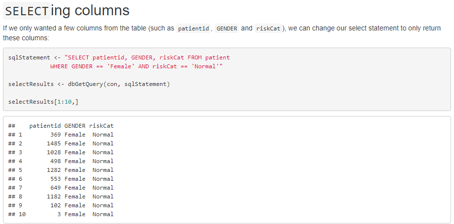

```{r setup, include=FALSE}
options(htmltools.dir.version = FALSE)

knitr::opts_chunk$set(fig.retina = 3, warning = FALSE, message = FALSE, echo=FALSE, out.width = "85%")
```


```{r xaringan-themer, include = FALSE}
library(xaringanthemer)
style_mono_light(
  base_color = "midnightblue",
  header_font_google = google_font("Josefin Sans"),
  text_font_google   = google_font("Montserrat", "300", "300i"),
  code_font_google   = google_font("Droid Mono"),
  link_color = "deepskyblue1",
  text_font_size = "28px"
)
```

```{css eval=FALSE}
```


```{r xaringanExtra, echo=FALSE}
xaringanExtra::use_xaringan_extra(c("tile_view", "logo", "tachyons"))
```

```{r xaringan-panelset, echo=FALSE}
xaringanExtra::use_panelset()
xaringanExtra::use_tachyons()
```

class: center, middle
# The MD in .Rmd
### Teaching Clinicians Data Analytics in R
### R/Medicine 2020

.large[**Ted Laderas** (`r icon::fa("envelope")`laderast@ohsu.edu | [`r icon::fa("twitter")`](https://twitter.com/tladeras) [tladeras](https://twitter.com/tladeras)) | Oregon Health & Science University | 
]

.large[**Brian Sikora** | Kaiser Permanente Insight ]

### Slides: [`r icon::fa("link")`](https://bit.ly/bmi569-rmed) https://bit.ly/bmi569-rmed


---
# Overview

6 Years of Data Analytics

- Introduction
- Our course
- Outcomes

.footnote[
[`r icon::fa("link")`](https://bit.ly/bmi569-rmed) https://bit.ly/bmi569-rmed
]
---
# Introduction

.pull-left[
```{r out.width = "60%"}
knitr::include_graphics("image/ted.jpg")
```
]

.pull-right[
- Ted Laderas, Assistant Professor, Medical Informatics and Clinical Epidemiology
- Bioinformatician / Collaborator
- RStudio Certified Instructor
  - [Ready for R](https://ready4r.netlify.app)
  - [R-Bootcamp](https://r-bootcamp.netlify.app)
]

---

class: center, middle
# How do you deliver actionable analytics in healthcare?

---
# Simulating Analytics 

.pull-left[
Analytics and Organizations:

- Data Science (R, OHSU)
- Organizational Aspects (KP Insight)

Combine in Final Presentation
]

.pull-right[
```{r echo=FALSE}
   
```
]

.footnote[
[`r icon::fa("link")`](https://bit.ly/bmi569-rmed) https://bit.ly/bmi569-rmed
]

???

- Execute a pilot study of a metric (LACE)
- Assess its effectiveness in a patient population
- Report the next steps to executive team

---
# Learner Persona

.pull-left[
Mary is a clinician who wants to understand how analytics can be delivered in her healthcare organization
  - Has little time
  - Likes learning on her own
  - Has a hard time asking for help, hard on herself
]

.pull-right[
```{r}

```
]

.footnote[
[`r icon::fa("link")`](https://bit.ly/bmi569-rmed) https://bit.ly/bmi569-rmed
]

---
# No Time

.pull-left[
.moon-gray[
Mary is a clinician who wants to understand how analytics can be delivered in her healthcare organization]

- Has little time

.moon-gray[
- Likes learning on her own
- Has a hard time asking for help, hard on herself]
]

.pull-right[ .bg-washed-green.b--dark-green.ba.bw2.br3.shadow-5.ph4.mt5[
- "Just in Time" instruction
- Assignments gradually increase in difficulty]
]

.footnote[
[`r icon::fa("link")`](https://bit.ly/bmi569-rmed) https://bit.ly/bmi569-rmed
]

---
# Self Learning

.pull-left[
.moon-gray[
Mary is a clinician who wants to understand how analytics can be delivered in her healthcare organization
- Has little time]

- Likes learning on her own

.moon-gray[
- Has a hard time asking for help, hard on herself]
]

.pull-right[.bg-washed-green.b--dark-green.ba.bw2.br3.shadow-5.ph4.mt5[
- RStudio.cloud
- RStudio Projects 
- Rmarkdown Assignments
]
]

???

Assignments are delivered as projects in RStudio Cloud within the Data Analytics Workspace.

We do our best to assess student performance and identify any difficulties with students. 

Clinicians tend to be hard on themselves.

---
# Help when you need it

.pull-left[
.moon-gray[
- Mary is a clinician who wants to understand how analytics can be delivered in her healthcare organization
- Has little time
- Likes learning on her own
]
- Has a hard time asking for help, hard on herself]
]

.pull-right[.bg-washed-green.b--dark-green.ba.bw2.br3.shadow-5.ph4.mt5[
- Slack for quick questions
- Office Hours
- Scheduled Appointments]
]

.footnote[
[`r icon::fa("link")`](https://bit.ly/bmi569-rmed) https://bit.ly/bmi569-rmed
]

---
# The Predictive Problem

.pull-left[
- Predict 30 day readmissions in a simulated hospital patient cohort
- Use a validated metric (LACE) on the dataset
- Communicate its effectiveness in a patient population
]

.pull-right[
```{r echo=FALSE}

```
]
---
# The Data

.pull-left[
- Simulated Data Warehouse
- 4 Month Extract of patients
- Based on real clinical data
]

.pull-right[
```{r echo=FALSE}
knitr::include_graphics("image/data_warehouse.jpg")
```
]
---
.panelset[
.panel[.panel-name[EDA]

```{r panel-chunk, echo=FALSE, out.width = "65%"}
knitr::include_graphics("image/visdat.png")
```
]

.panel[.panel-name[SQL]
```{r echo=FALSE, out.width = "85%"}

```
]

.panel[.panel-name[SQL2]
```{r echo=FALSE, out.width = "90%"}

```
]

.panel[.panel-name[Predictive Modeling]
```{r, echo=FALSE, out.width="70%"}
knitr::include_graphics("image/roc-curve.png")
```
]

.panel[.panel-name[Machine Learning]
```{r, echo=FALSE, out.width="70%"}

```
]

]

---
# Final Presentation

.pull-left[
- Present modeling results to an Executive Team
- What is in the Data?
- Having an Ask/Call to Action
]


---
class: center, middle
# Presentation Examples

---
.panelset[
.panel[.panel-name[1]

```{r echo=FALSE, out.width="60%"}

```

Meenakashi Mishra/Kevin Watanabe-Smith 
]

.panel[.panel-name[2]
```{r echo=FALSE, out.width="60%"}
knitr::include_graphics("image/brenner-goueth-poire.png")
```

Arielle Brenner/Rose Goueth/Alfonso Poire
]

.panel[.panel-name[3]

```{r echo=FALSE, out.width="70%"}

```

Pierrette Lo/Mitchell Strauss
]

.panel[.panel-name[4]

```{r echo=FALSE, out.width="60%"}

```

Dan Slater/Laura Hickerson
]


.panel[.panel-name[5]

```{r echo=FALSE, out.width="60%"}
knitr::include_graphics("image/nguyen-yaeger-wang.png")
```

Justine Nguyen/Dan Yaeger/Xiao Wang
]

.panel[.panel-name[6]
```{r echo=FALSE, out.width="70%"}
knitr::include_graphics("image/grout-lin-xu.png")
```

Megan Grout/Wei-Chun Lin/Colleen Xu
]

]

---
class: center, middle

# Student Testimonies
---
# Themes: Collaboration

.bg-washed-green.b--dark-green.ba.bw2.br3.shadow-5.ph4.mt5[
Taking the Data Analytics course made me a .b[much more patient and effective collaborator], especially when working with colleagues outside of science.

.tr[
— Kristen Stevens, MD/PhD Candidate
]]

---
# Themes: Diversity

.bg-washed-green.b--dark-green.ba.bw2.br3.shadow-5.ph4.mt5[I highly recommend this course to anyone who wishes to get a comprehensive introduction to R and the field of data analytics. .b[The course attracts [a] very diverse set of students.] The hybrid nature of the course was ideal to get to meet and network with others.


.tr[
— Meenakashi Mishra, Clinical Informatics Fellow
]]

---
# Themes: Soup to Nuts

.bg-washed-green.b--dark-green.ba.bw2.br3.shadow-5.ph4.mt5[I would definitely recommend this to .b[anyone who is interested in working with data in a healthcare setting], whether you’re a clinician/researcher who will be gathering and using the data, or a manager who might be presenting the data or incorporating analytics into your organization’s workflow.

.tr[
— Pierrette Lo, Relationship Manager/Data Scientist
]]

---
# We won an award!

## 2020 Sakai Torchbearer Award

.bg-washed-green.b--dark-green.ba.bw2.br3.shadow-5.ph4.mt5[
Nominations praised the careful curriculum, .b[responsive and available instructors] (including those drawn from outside of OHSU), .b[meticulously planned projects], and the use of R notebooks and RStudio, resulting in .b[essential research skills] “not only in bioinformatics/computer science, but generally across biology and medicine.” 

Lastly, nominators said that Dr. Laderas offers generous feedback and considerable time to supporting learners with these projects through multiple technical modalities.]

---
# Conclusions

- Melding practical and organizational skills 
- Talk about real life lessons
- Apply that knowledge

---
## Thank You/Questions?

.pull-left[
.small[
- OHSU/DMICE
  - David Dorr
  - Shannon McWeeney
  - Tracy Edinger
  - Virginia Lankes
  - Mark Klick
  - Aaron Coyner
]
Slides done with `xaringan` and `xaringanExtra`
]

.pull-left[
.small[
- KP Insight Team
  - Delilah Moore
  - Eric Johnson
  - Allison Schmidt
  - Michele Schmidt
  - Bryan Simmons
  - Erin Dirks
  - Chris Lattig
  - Yvonne Rice
  - Vivian Tan
  - Karen Schartman
  ]
]

.footnote[
[`r icon::fa("link")`](https://bit.ly/bmi569-rmed) https://bit.ly/bmi569-rmed
]
